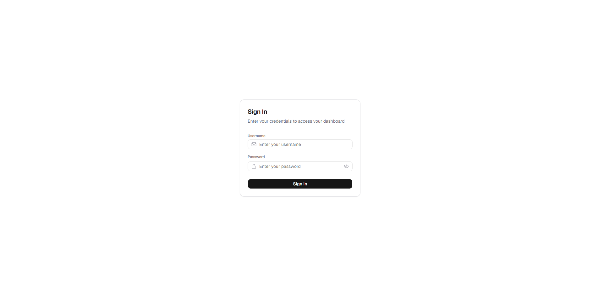
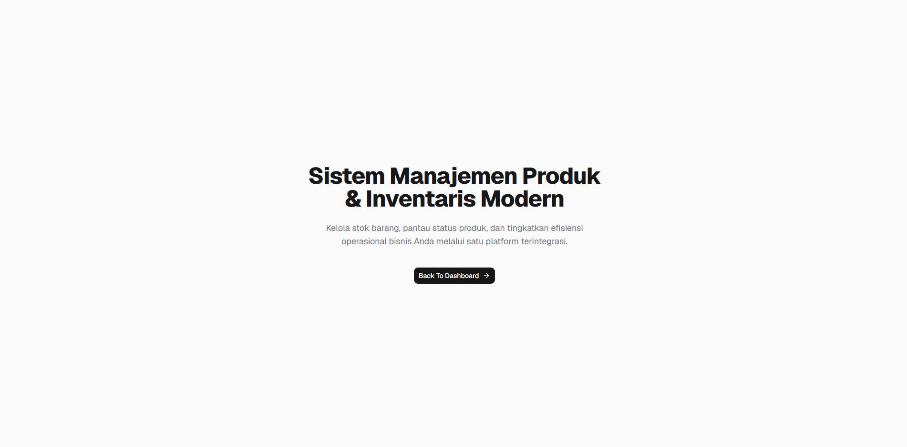
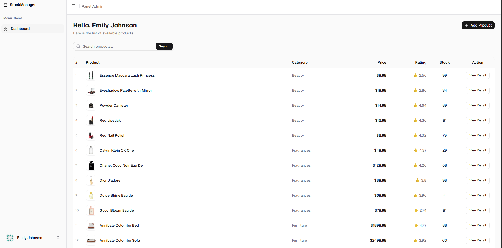
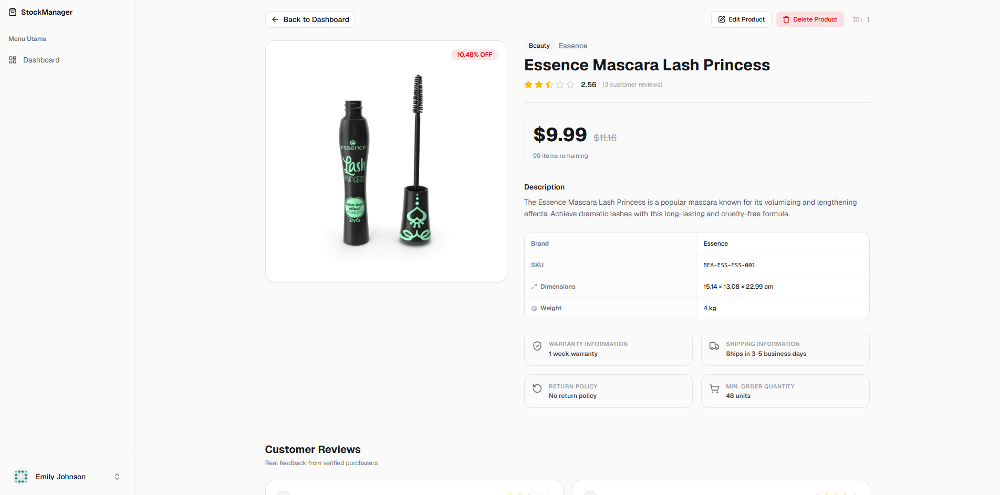

# StockManager — React Product Management

Aplikasi manajemen produk & inventaris berbasis web yang dibangun dengan React + Vite. Data produk diambil dari [DummyJSON API](https://dummyjson.com).

## Screenshots

### Halaman Login



### Halaman Utama



### Dashboard Produk



### Detail Produk



---

## Fitur

- **Autentikasi** — Login & logout menggunakan JWT via DummyJSON Auth API
- **Daftar Produk** — Tabel produk dengan pencarian berdasarkan nama
- **Detail Produk** — Informasi lengkap produk: gambar, harga, diskon, stok, review, dimensi, garansi, dll.
- **Edit Produk** — Update judul dan detail produk
- **Hapus Produk** — Konfirmasi sebelum menghapus
- **Tambah Produk** — Form tambah produk baru
- **Profil Pengguna** — Menampilkan data profil yang sedang login
- **Responsive** — Sidebar mobile-friendly

---

## Tech Stack

| Kategori         | Library                     |
| ---------------- | --------------------------- |
| Framework        | React 19 + Vite 8           |
| State Management | Redux Toolkit + React-Redux |
| Routing          | React Router DOM v7         |
| UI Components    | shadcn/ui (Radix UI)        |
| Styling          | Tailwind CSS v4             |
| HTTP Client      | Axios                       |
| Icons            | Lucide React                |
| Alert Dialog     | SweetAlert2                 |
| Font             | Geist (Variable)            |

---

## Cara Menjalankan

### Prasyarat

- Node.js >= 18
- npm >= 9

### Instalasi

```bash
# Clone repository
git clone <repo-url>
cd react-product-management

# Install dependencies
npm install
```

### Konfigurasi Environment

Salin file `.env.example` menjadi `.env`:

```bash
cp .env.example .env
```

Isi variabel yang dibutuhkan:

```env
VITE_API_BASE_URL=https://dummyjson.com
```

### Menjalankan Development Server

```bash
npm run dev
```

Buka [http://localhost:5173](http://localhost:5173) di browser.

### Build Production

```bash
npm run build
```

### Preview Build

```bash
npm run preview
```

---

## Struktur Project

```
src/
├── api/              # Konfigurasi Axios instance
├── components/
│   ├── common/       # Header, Footer, AppSidebar
│   └── ui/           # Komponen UI (shadcn)
├── hooks/            # Custom hooks (useIsMobile, dll.)
├── layout/           # AppLayout
├── lib/              # Utility functions
├── pages/            # Halaman: Home, Login, Dashboard, ProductDetail, Profile
└── store/            # Redux store: auth, products, profile
```

---

## Akun Demo

Gunakan akun berikut untuk login (via DummyJSON):

| Field    | Value        |
| -------- | ------------ |
| Username | `emilys`     |
| Password | `emilyspass` |

> Semua operasi (tambah, edit, hapus) bersifat simulasi — data tidak benar-benar tersimpan di server karena menggunakan DummyJSON yang merupakan fake REST API.
